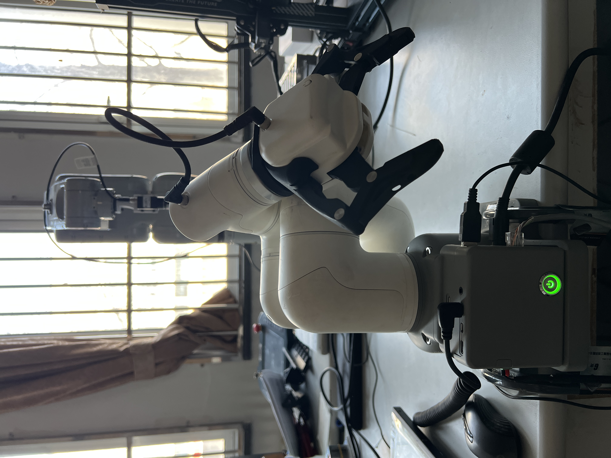

# ElephantArm


本仓库包含 `pymycobot` 本地源码、官方 demo，以及一个基于 `myCobot 320 Pi` 的固定点抓放项目。

<p align="center">
  
</p>


## 目录结构

- [pymycobot](pymycobot)
  `pymycobot` 本地源码目录。
- [demo](demo)
  官方示例和测试脚本。
- [docs](docs)
  说明文档。
- [projects/320pi_pick_teacher](projects/320pi_pick_teacher)
  当前主要项目。用于 `myCobot 320 Pi` 的关键点示教、抓放执行和 TCP 握手联调。

## 当前主项目

主项目目录：

- [projects/320pi_pick_teacher](projects/320pi_pick_teacher)

核心文件：

- [projects/320pi_pick_teacher/pick_teach_loop.py](projects/320pi_pick_teacher/pick_teach_loop.py)
  树莓派端抓放执行脚本。
- [projects/320pi_pick_teacher/host_ok_server.py](projects/320pi_pick_teacher/host_ok_server.py)
  主机端最小 TCP 联调脚本。
- [projects/320pi_pick_teacher/pick_task_320pi.template.json](projects/320pi_pick_teacher/pick_task_320pi.template.json)
  任务模板。
- [projects/320pi_pick_teacher/README.md](projects/320pi_pick_teacher/README.md)
  项目详细说明。

## 项目能力

`320pi_pick_teacher` 当前已经实现：

- 单物品和多物品抓取
- 关键点示教
- 固定抓取、等待、放置流程
- 夹爪控制
- TCP 握手
- 主机端 `OK -> OK` 联调脚本

## 最小使用路径

1. 阅读项目说明：
   [projects/320pi_pick_teacher/README.md](projects/320pi_pick_teacher/README.md)
2. 在电脑端启动主机测试脚本：

```bash
python projects/320pi_pick_teacher/host_ok_server.py --port 25001 --reply-delay 5
```

3. 在树莓派端启动机械臂脚本：

```bash
python3 projects/320pi_pick_teacher/pick_teach_loop.py --host 192.168.253.131 --host-port 25001
```

## 说明

- 当前仓库以本地开发和实机联调为主。
- 更详细的操作流程、点位说明和网络联调说明请看项目内 README。
